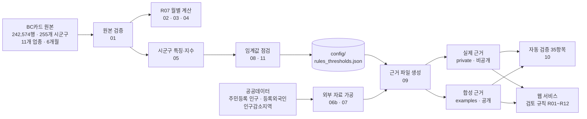
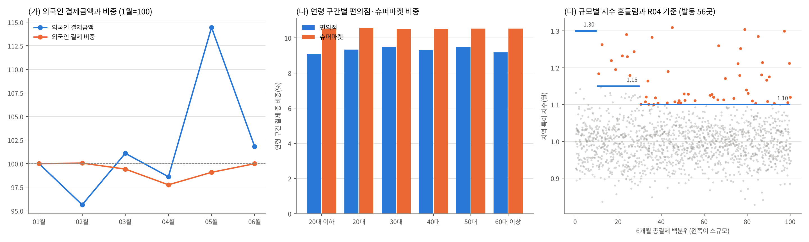
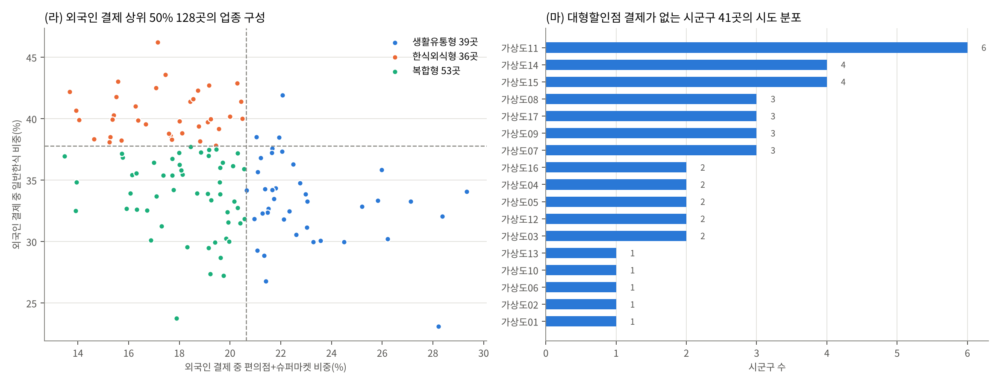

# 콕콕 — 소비 데이터로 지역사업 기획을 검토하는 서비스 (데이터 파트)

> 지자체가 지역 소비 활성화 사업(지역화폐·쿠폰·축제 등)을 기획할 때, BC카드 소비 데이터로 **"이 기획에서 다시 확인할 점"을 콕 집어 질문**해 주는 웹 서비스의 데이터 분석·검토 규칙·근거 설계 파트

- **대회**: [제1회 AI금융빅데이터플랫폼 소비데이터 활용 분석·아이디어 공모전](https://abp.bccard.com/dataContest/dataContestDetailPage?contestNo=9000001) (비씨카드 주최)
- **기간**: 2026.08.26 ~ 2026.09.22
- **데이터**: BC카드 제공 전국 시군구·업종별 카드 결제 집계(2026-01~06, 242,574행 · 255개 시군구 · 11개 업종) + 공공데이터(주민등록 인구 · 등록외국인 · 인구감소지역)
- **역할**: 팀 프로젝트 중 **데이터 파트** 담당 — 원본 검증, 분석, 검토 규칙 임계값 설계, 근거 파일 생성·자동 검증 (웹 서비스 구현은 개발 담당 팀원)
- **작성자**: 손지영 · 2026.10
- **산출물**: 아이디어 요약서, 웹 서비스 콕콕, 근거 파일(JSON) 생성·검증 파이프라인

> 공모전 제공 원본은 규정상 재배포할 수 없어 이 저장소에 없습니다. 코드·설정·문서와 **합성 데이터**만 공개하며, 원본 없이도 가짜 원본으로 전체 파이프라인을 실행해 볼 수 있습니다.

---

## 1. 문제 정의

지역 소비 활성화 사업은 목표·대상·사용처·기간·성과지표가 서로 맞물려야 효과를 볼 수 있습니다. 하지만 기획 단계에서 "고른 사용처 업종이 이 지역에서 실제로 결제가 있는가", "외국인 카드 결제를 관광객 지표로 써도 되는가" 같은 점을 데이터로 확인하기는 어렵습니다.

콕콕은 담당자가 기획 내용을 입력하면 카드 소비 데이터를 근거로 **확인 질문**을 띄워, 기획의 빈틈을 사업 전에 점검하도록 돕습니다. 정답을 대신 내리는 것이 아니라 다시 볼 지점을 짚어 주는 것이 목표입니다.

## 2. 서비스 안에서 데이터 파트가 하는 일



담당자가 사업 목표·대상·사용처·기간·성과지표를 입력하면 서비스가 규칙(R01~R12)을 돌려 확인 질문을 띄웁니다. 데이터 파트는 질문의 근거가 되는 시군구별 근거 파일(JSON)과, 질문을 언제 띄울지 정하는 임계값을 만듭니다.

| 규칙 | 묻는 것 | 데이터 근거 |
| --- | --- | --- |
| R02 | 고른 사용처 업종이 이 지역에서 결제가 거의 없지 않은가 | 업종 비중 하위 20%, 결제 없음 |
| R03 | 대상(관광객)과 성과지표(외국인 카드)의 범위가 맞는가 | 외국인 결제 업종 구성 3유형 |
| R04 | 사업 시기가 평소와 다른 달인가 / 기간이 월 집계보다 짧은가 | 규모별 지역 특이 지수 기준 |
| R07 | 성과지표가 금액인가 비중인가 | 외국인 결제금액과 비중의 방향 차이 |
| R08 | 대상 연령이 이 업종에서 결제가 적은 연령인가(참고용) | 업종×연령 비중 하위 20% |
| R11·R12 | 방문객 규모가 인구에 비해 큰가 / 외국인 대상 기반이 있는가 | 주민등록 인구, 외국인 비중 하위 20% |

## 3. 분석 인사이트 8개

수치는 실제 원본으로 계산해 요약서에 실은 전국·집계 수준 값입니다(시군구별 값은 공개하지 않습니다). 재현 코드는 `src/12_insights_figures.py`, `notebooks/analysis_reproducibility.ipynb`입니다.

| # | 인사이트 | 서비스 반영 |
| --- | --- | --- |
| 1 | 외국인 결제금액과 외국인 비중은 인접 월 5개 구간 **모두 반대 방향**이었다(4→5월 금액 +11.0%, 비중 7.45%→7.28%) | R07: 성과지표가 금액인지 비중인지 먼저 묻는다 |
| 2 | 대형할인점 결제가 없는 시군구가 **57곳(22%)**, 전남·경북·강원에 몰려 있다 | R02: 결제 0은 하위 20%와 따로 "결제 없음"으로 표시 |
| 3 | 편의점 비중은 20대 이하 31.5% → 60대 이상 8.1%, 슈퍼마켓은 5.9% → 22.2%로 연령에 따라 반대로 움직인다 | R08: 업종×연령 쌍으로 점검 |
| 4 | 외국인 결제 상위 50% 128곳의 업종 구성은 **생활유통형 39·한식외식형 39·복합형 50**으로 나뉜다. 외국인 결제 상위 지역 다수는 관광지가 아니라 산업·거주 도시다 | R03: 외국인 카드 지표는 관광객만이 아니라는 확인 질문 |
| 5 | 외국인 결제 비중은 하위 10% 3.3% 이하, 중앙값 6.2%, 상위 10% 11.9% 이상으로 지역 차이가 크다 | R12: 하위 20%(약 3.9% 이하)를 대상 기반 확인 지점으로 |
| 6 | 전국 5월 결제가 다른 달 평균보다 14.5% 크다. 전국 흐름을 뺀 지수의 흔들림은 소규모 지역(0.127)이 대규모(0.035)의 약 3.6배다 | R04: 규모별 3단계 기준(1.30·1.15·1.10), 30곳(12%) 발동 |
| 7 | 성별·연령 미상 비중이 지역별로 0.65%~36.1%까지 벌어진다 | R07: 전체 분모 비중과 미상 제외 비중을 함께 표시 |
| 8 | 일반한식 비중은 하위 10% 31.6% ~ 상위 10% 49.8%. 군집 실루엣이 0.15~0.17로 낮아 군집 대신 **최근접 이웃 5곳**을 유사 지자체로 채택 | R09: 유사 지자체 비교 |

## 4. 임계값 설계 — "통계 임계값이 아니라 운영 기준"

규칙이 너무 자주 울리면 담당자가 무시하고, 너무 드물면 쓸모가 없습니다. 그래서 임계값을 세 기준으로 점검했습니다. 근거는 [`docs/임계값_결정표.md`](docs/임계값_결정표.md), 계산은 `src/11_threshold_decision.py`입니다.

- **재현성**: 1~3월과 4~6월에 같은 규칙을 따로 적용했을 때 같은 지역이 뽑히는가(Jaccard 0.8 안팎 이상)
- **발동 빈도**: 한 규칙이 전체 시군구의 20~25%를 넘게 걸리지 않는가
- **절대 수준**: 순위만이 아니라 평소 변동보다 실제로 큰 값인가

| 규칙 | 값 | 반기 재현성 |
| --- | --- | --- |
| R02 업종 비중 낮음 | 하위 20% | 0.81 |
| R12 외국인 비중 낮음 | 하위 20% | 0.79 |
| R08 업종×연령 비중 낮음 | 하위 20% (재현성이 낮아 **참고용 표시**) | 0.75 |
| R03 외국인 업종 유형 | 외국인 결제 상위 50% 중 각 상위 30% | 0.91(유형 일치율) |
| R04 시기 | 규모 하위 10% 1.30 / 10~30% 1.15 / 나머지 1.10 | 1 + 2.5 × 규모별 견고 표준편차 |

R04는 처음에 "같은 달 상위 20%"로 정했지만, 그러면 매달 51곳이 자동으로 걸려 6개월 중 한 번이라도 걸리는 시군구가 74%가 됩니다. 일수와 전국 월 흐름을 뺀 **지역 특이 지수**를 만들고, 규모가 작을수록 평소 흔들림이 크다는 점을 반영해 규모 구간별 기준으로 바꿨습니다(발동 30곳, 12%).

모든 임계값은 [`config/rules_thresholds.json`](config/rules_thresholds.json) 한 곳에서 관리하고, 근거 파일 생성(09)·검증(10)·결정 근거(11)·인사이트(12)가 같은 파일을 읽습니다.

## 5. 검증 — 자동 35항목

`src/10_verify_evidence.py`는 근거 파일이 원본과 맞는지를 35항목으로 확인합니다. 근거 파일 생성기(pandas 피벗)와 **다른 방식**(csv 행 단위 누적)으로 원본을 다시 계산해 대조합니다. 자세한 절차는 [`docs/검증_절차_가이드.md`](docs/검증_절차_가이드.md).

| 구분 | 항목 수 | 확인 내용 |
| --- | --- | --- |
| 구조 | 7 | 버전, 기록 수, 실제·합성 파일 키 구성 일치, 임계값 = 설정 파일 |
| 합계 | 7 | 비중 합 100, 월 합 = 총액, 전국 = 시군구 합, 값 범위 |
| 원본 재계산 | 4 | 원본 규모, 표본 14곳 월별 F·T·U·C 원 단위 일치, 업종 비중, 전국 합 |
| 집계값 | 8 | 결제 없음 57건, R03 분포, 소액 51곳, R04 30곳, R12 51곳, 기준·플래그 내부 일관성 |
| 합성 시나리오 | 9 | 실제 지명 미포함, 시나리오 A~L이 기대대로 켜지는지 |

## 6. 데이터 보안 원칙

- 원본과 시군구별 실제 수치(실제 근거 파일, 중간 산출물, 분석 결과)는 `private/`, `work/`, `output/`에만 두고 `.gitignore`로 막았습니다.
- 공개용 근거 파일은 임의 모수로 만든 **가상 255개 시군구**에서 계산한 합성 자료이며, 검증 D01이 실제 지명이 섞이지 않았는지 확인합니다.
- 서비스의 AI 참고 의견에는 실제 카드 금액·비중·건수를 넘기지 않고 규칙 결과에 대한 상황 설명만 넘깁니다([`docs/검토규칙_데이터검수.md`](docs/검토규칙_데이터검수.md)).

## 7. 실행

```bash
pip install -r requirements.txt

# 원본이 없을 때: 가짜 원본으로 전체 실행 점검
python src/make_synthetic_raw.py
export BC_RAW_CSV=data/synthetic/ABP_SYNTHETIC.csv
python src/12_insights_figures.py --out output/synthetic            # 인사이트 8개 + 그림 1·2
python src/11_threshold_decision.py                                  # 임계값 근거
python src/09_make_evidence.py synthetic                             # 공개용 합성 근거
python src/09_make_evidence.py real --no-external --out private/smoke_real.json
python src/10_verify_evidence.py --mode check --real private/smoke_real.json   # 35항목

# 원본이 있을 때(data/ABP_CONTEST_DATA.csv + data/external/ 공공데이터 가공본)
python src/01_check_data.py && python src/02_make_r07.py && python src/03_compare_r07.py
python src/09_make_evidence.py real && python src/09_make_evidence.py synthetic
python src/10_verify_evidence.py                                     # 보고 집계값까지 대조
python src/12_insights_figures.py
```

아래 그림은 **가짜 원본으로 그린 예시**입니다(실제 분석 그림과 수치가 다릅니다).




## 8. 폴더 구조

```
config/rules_thresholds.json   운영 임계값(단일 설정 파일)
src/
  common.py                    경로·원본 읽기·업종 코드 공통
  01_check_data.py             원본 검증
  02_make_r07.py               월별 F·T·U·C와 비중(R07)
  03_compare_r07.py            인접 월 금액·비중 방향 비교
  04_make_review_json.py       근거 파일 2.0(전국 R07)
  05_build_features.py         시군구 특징·지역 특이 지수
  06b_region_map_csv.py        시군구 → 행정구역 코드, 인구감소지역
  07_process_external.py       주민등록 인구·등록외국인 가공(구 개편·통합 보정)
  08_threshold_sensitivity.py  임계 기준 민감도 탐색
  09_make_evidence.py          근거 파일 2.1 생성(실제·합성)
  10_verify_evidence.py        자동 검증 35항목
  11_threshold_decision.py     임계값 결정 근거(재현성·R04 기준 도출)
  12_insights_figures.py       인사이트 8개·그림 1·2
  make_synthetic_raw.py        실행 점검용 가짜 원본
notebooks/analysis_reproducibility.ipynb   위 과정을 순서대로 실행하는 노트북
examples/review_evidence_demo_v2.1.json    공개용 합성 근거 파일
docs/                          데이터 노트, 임계값 결정표, 검증 절차, 근거 파일 스키마, 규칙 검수
```

## 9. 한계

- BC카드 결제만 포함하며 현금·타사 카드는 없습니다. 외국인은 성별 코드 3이라 관광객과 거주 외국인을 구분하지 못합니다.
- 6개월 월 단위 자료라 계절성은 단정하지 않았습니다.
- 시군구를 가맹점 소재지로 간주했습니다(주최 측 확인 전).
- 임계값은 담당자 사용 검증 전의 값이며, 실제 사용에서 "질문이 너무 많다·적다"가 나오면 조정할 계획이었습니다.
